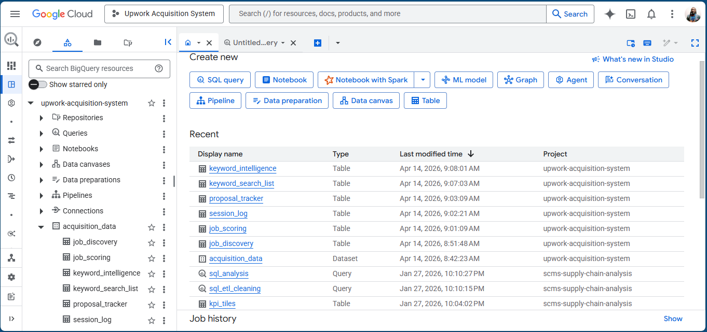
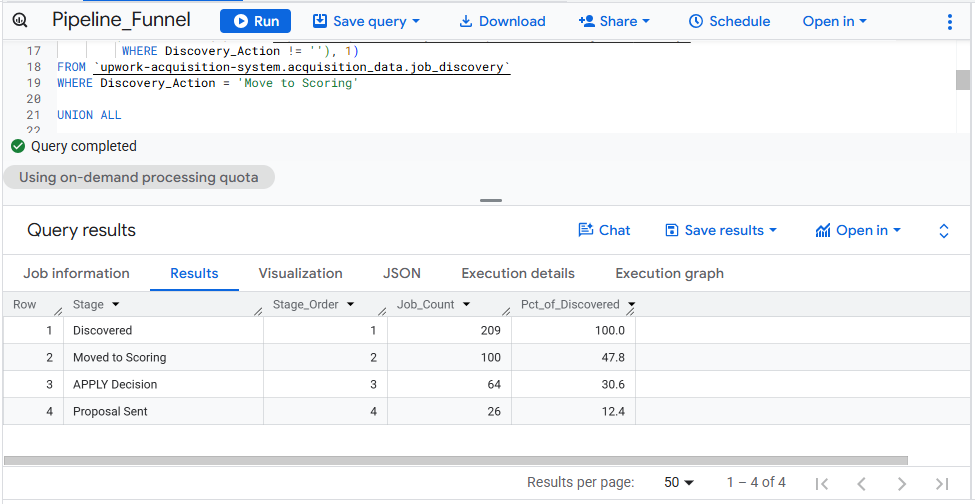
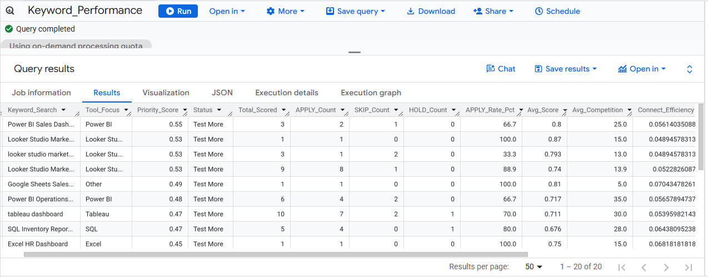
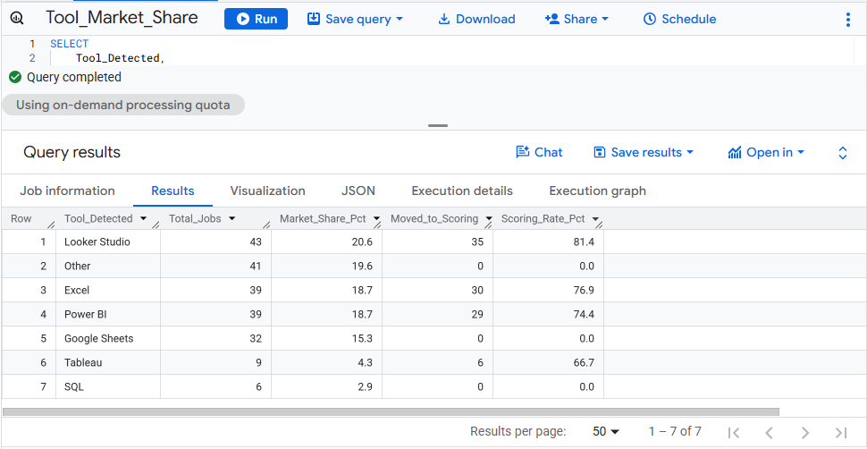
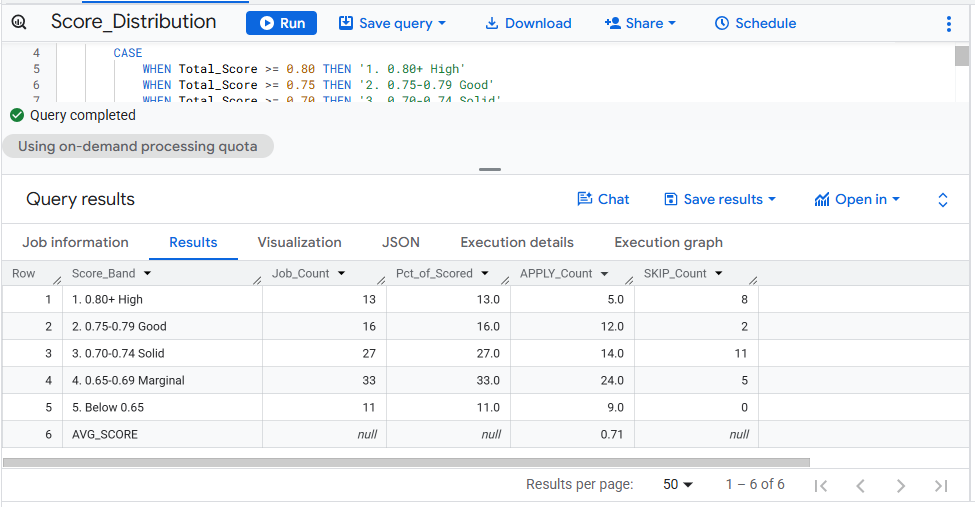
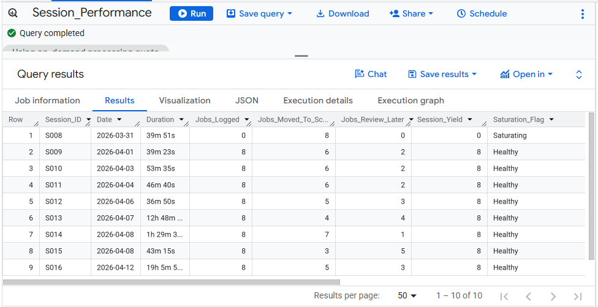
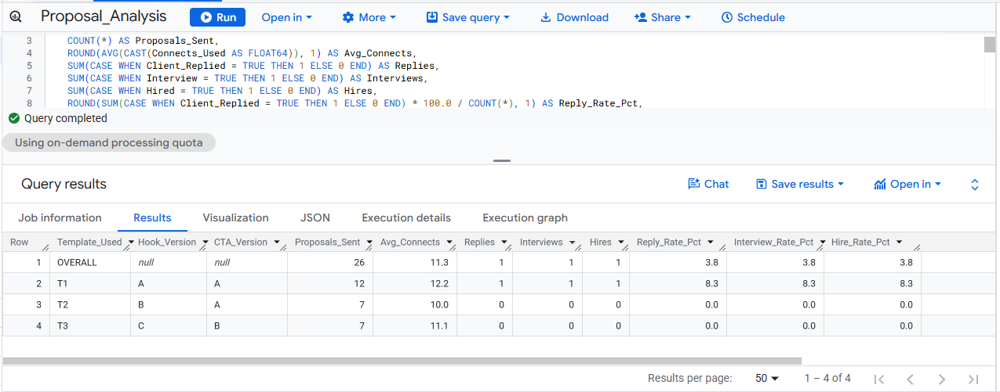
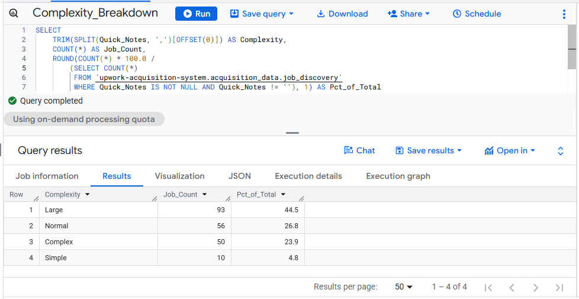
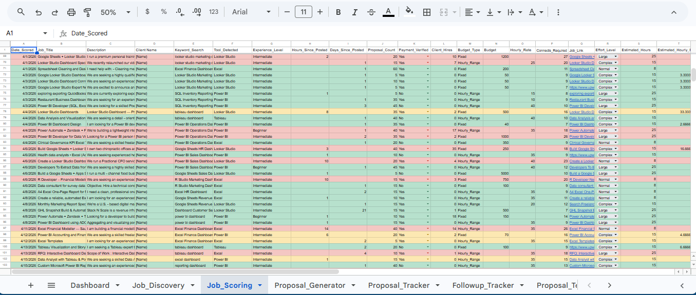
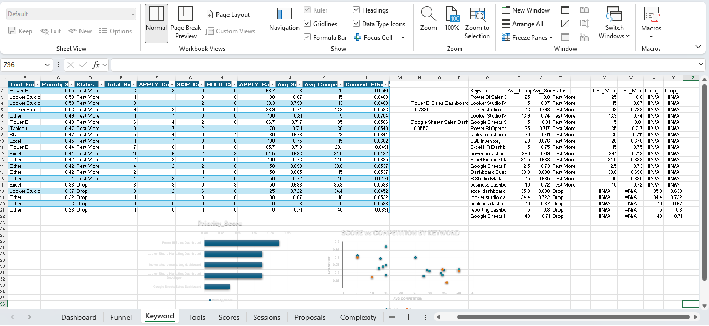

# 🔍 Upwork Client Acquisition Pipeline

**End-to-end data pipeline tracking freelance client acquisition across job discovery, scoring, and proposal activity.**

---

## 📌 Project Overview

Built a fully automated client acquisition system for Benchline Analytics, a freelance data analytics consultancy. The pipeline tracks every stage from job discovery through proposal submission, using Google Sheets as the operational layer and BigQuery as the analytical layer.

**Pipeline flow:**
Google Sheets (live data entry + Apps Script automation) → CSV exports → BigQuery → SQL analysis → Excel dashboard

---

## 📊 Data Scope

| Table | Rows | Description |
|-------|------|-------------|
| job_discovery | 193 | All jobs logged across 19 sessions |
| job_scoring | 109 | Jobs scored and assigned APPLY / SKIP / HOLD |
| session_log | 19 | Session-level activity and yield tracking |
| proposal_tracker | 26 | Proposals sent with outcome tracking |
| keyword_search_list | 18 | Active keyword targets |
| keyword_intelligence | 18 | Keyword priority scoring and status |

---

## 🗂️ SQL Queries

<!-- ===================== -->
<!--        PREVIEW        -->
<!-- ===================== -->


| File | Description |
|------|-------------|
| [01_pipeline_funnel](https://github.com/visualkirby/Upwork-Acquisition-Pipeline/blob/main/01_pipeline_funnel.sql) | Conversion rates across all 4 pipeline stages |
| [02_keyword_performance](https://github.com/visualkirby/Upwork-Acquisition-Pipeline/blob/main/02_keyword_performance.sql) | APPLY rate, avg score, competition, and efficiency by keyword |
| [03_tool_market_share](https://github.com/visualkirby/Upwork-Acquisition-Pipeline/blob/main/03_tool_market_share.sql) | Job volume and scoring rate by BI tool |
| [04_score_distribution](https://github.com/visualkirby/Upwork-Acquisition-Pipeline/blob/main/04_score_distribution.sql) | Score band breakdown with APPLY/SKIP counts + avg score |
| [05_session_performance](https://github.com/visualkirby/Upwork-Acquisition-Pipeline/blob/main/05_session_performance.sql) | Session-level yield, connects, and proposal activity |
| [06_proposal_analysis](https://github.com/visualkirby/Upwork-Acquisition-Pipeline/blob/main/06_proposal_analysis.sql) | Template performance with reply, interview, and hire rates |
| [07_complexity_breakdown](https://github.com/visualkirby/Upwork-Acquisition-Pipeline/blob/main/07_complexity_breakdown.sql) | Priority score, connect efficiency, and status by keyword |

<!-- ===================== -->
<!--        PREVIEW        -->
<!-- ===================== -->


<!-- ===================== -->
<!--        PREVIEW        -->
<!-- ===================== -->



<!-- ===================== -->
<!--        PREVIEW        -->
<!-- ===================== -->



<!-- ===================== -->
<!--        PREVIEW        -->
<!-- ===================== -->



<!-- ===================== -->
<!--        PREVIEW        -->
<!-- ===================== -->



<!-- ===================== -->
<!--        PREVIEW        -->
<!-- ===================== -->



<!-- ===================== -->
<!--        PREVIEW        -->
<!-- ===================== -->



---

## ⚙️ Apps Script System

The Google Sheets automation handles:
- Session management (start, end, yield tracking)
- Job discovery logging with AI-powered Quick Notes classification
- Duplicate job link detection
- Auto-scoring triggers when Final_Decision = APPLY
- AI proposal generation via GPT-4o-mini
- Bid recommendation engine
- Proposal and follow-up tracker auto-population
- Month-end snapshot to Monthly_Performance tab
- Keyword mining from job descriptions

[Upwork Acquisition System Apps Script](https://github.com/visualkirby/Upwork-Acquisition-Pipeline/blob/main/upwork_acquisition_system.gs) 
---

## 🔑 Key Results (April 2026)

| Metric | Value |
|--------|-------|
| Jobs Discovered | 209 |
| Moved to Scoring | 121 (57.9%) |
| APPLY Decisions | 85 (40.7%) |
| Proposals Sent | 26 (12.0%) |
| Replies | 1 |
| Interviews | 1 |
| Hires | 1 |
| Avg Job Score | 0.71 |
| Top Keyword by Priority | Power BI Sales Dashboard |

---

## 🛠️ Tools & Technologies

<!-- ===================== -->
<!--        PREVIEW        -->
<!-- ===================== -->


- **Google Sheets** — operational data entry and formula layer
- **Google Apps Script** — automation, AI integration, session management
- **BigQuery** — SQL analysis and data warehousing
- **OpenAI GPT-4o-mini** — Quick Notes classification, proposal generation, bid recommendations
- **Excel** — dashboard visualization layer

<!-- ===================== -->
<!--        PREVIEW        -->
<!-- ===================== -->


---

## 📁 Repository Structure

```
Upwork-Acquisition-Pipeline/
├── README.md
├── queries/
│   ├── 01_pipeline_funnel.sql
│   ├── 02_keyword_performance.sql
│   ├── 03_tool_market_share.sql
│   ├── 04_score_distribution.sql
│   ├── 05_session_performance.sql
│   ├── 06_proposal_analysis.sql
│   └── 07_complexity_breakdown.sql
├── apps_script/
│   └── upwork_acquisition_system.gs
└── screenshots/
    ├── Google_BigQuery.png
    ├── Pipeline_Funnel_Results.png
    ├── Keyword_Performance_Results.png
    ├── Tool_Market_Share_Results.png
    ├── Score_Distribution_Results.png
    ├── Session_Performance_Results.png
    ├── Proposal_Analysis_Results.png
    ├── Complexity_Breakdown_Results.png
    ├── Google_Sheets_System.png
    └── Excel_System.png
```

---

## 🔗 Related Project

The SQL exports from this pipeline feed directly into the Excel dashboard:
[Upwork Acquisition Dashboard](https://github.com/visualkirby/Upwork-Acquisition-Dashboard)
