# 🔍 Upwork Client Acquisition Pipeline

**End-to-end data pipeline tracking freelance client acquisition across job discovery, scoring, and proposal activity.**

---

## 📌 Project Overview

Built a fully automated client acquisition system for Benchline Analytics, a freelance data analytics consultancy. The pipeline tracks every stage from job discovery through proposal submission, using Google Sheets as the operational layer and BigQuery as the analytical layer.

**Pipeline flow:**
Google Sheets (live data entry + Apps Script automation) → CSV exports → BigQuery → SQL analysis → Excel dashboard

---

## 📊 Data Scope

| Table | Rows | Description |
|-------|------|-------------|
| job_discovery | 193 | All jobs logged across 19 sessions |
| job_scoring | 109 | Jobs scored and assigned APPLY / SKIP / HOLD |
| session_log | 19 | Session-level activity and yield tracking |
| proposal_tracker | 26 | Proposals sent with outcome tracking |
| keyword_search_list | 18 | Active keyword targets |
| keyword_intelligence | 18 | Keyword priority scoring and status |

---

## 🗂️ SQL Queries

<!-- ===================== -->
<!--        PREVIEW        -->
<!-- ===================== -->
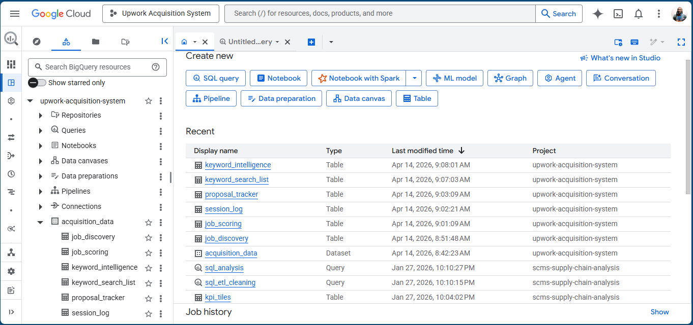

| File | Description |
|------|-------------|
| [01_pipeline_funnel](https://github.com/visualkirby/Upwork-Acquisition-Pipeline/blob/main/queries/01_pipeline_funnel.sql) | Conversion rates across all 4 pipeline stages |
| [02_keyword_performance](https://github.com/visualkirby/Upwork-Acquisition-Pipeline/blob/main/queries/02_keyword_performance.sql) | APPLY rate, avg score, competition, and efficiency by keyword |
| [03_tool_market_share](https://github.com/visualkirby/Upwork-Acquisition-Pipeline/blob/main/queries/03_tool_market_share.sql) | Job volume and scoring rate by BI tool |
| [04_score_distribution](https://github.com/visualkirby/Upwork-Acquisition-Pipeline/blob/main/queries/04_score_distribution.sql) | Score band breakdown with APPLY/SKIP counts + avg score |
| [05_session_performance](https://github.com/visualkirby/Upwork-Acquisition-Pipeline/blob/main/queries/05_session_performance.sql) | Session-level yield, connects, and proposal activity |
| [06_proposal_analysis](https://github.com/visualkirby/Upwork-Acquisition-Pipeline/blob/main/queries/06_proposal_analysis.sql) | Template performance with reply, interview, and hire rates |
| [07_complexity_breakdown](https://github.com/visualkirby/Upwork-Acquisition-Pipeline/blob/main/queries/07_complexity_breakdown.sql) | Priority score, connect efficiency, and status by keyword |

<!-- ===================== -->
<!--        PREVIEW        -->
<!-- ===================== -->
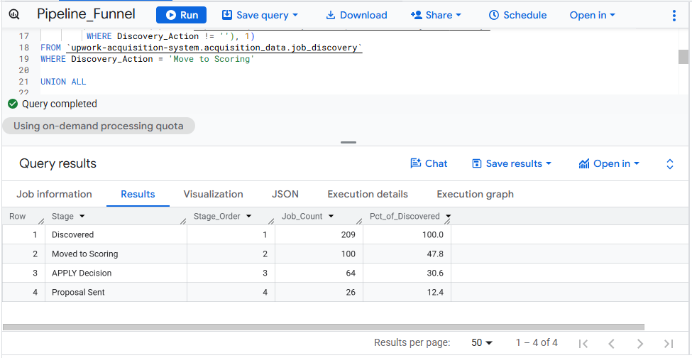

<!-- ===================== -->
<!--        PREVIEW        -->
<!-- ===================== -->
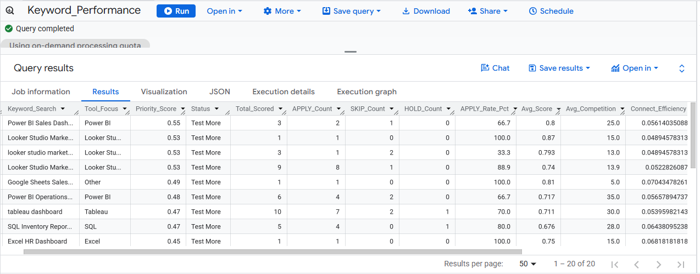


<!-- ===================== -->
<!--        PREVIEW        -->
<!-- ===================== -->
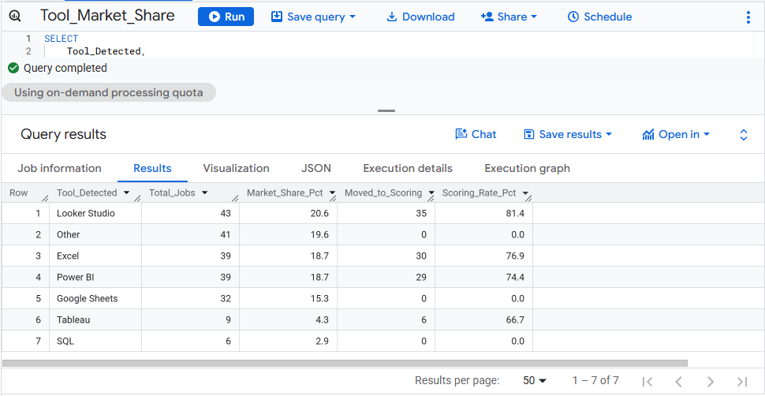


<!-- ===================== -->
<!--        PREVIEW        -->
<!-- ===================== -->
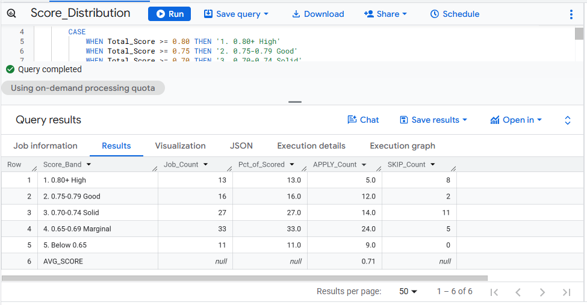


<!-- ===================== -->
<!--        PREVIEW        -->
<!-- ===================== -->
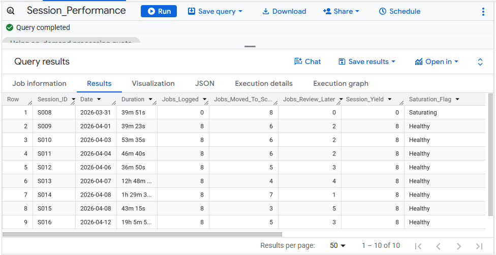


<!-- ===================== -->
<!--        PREVIEW        -->
<!-- ===================== -->
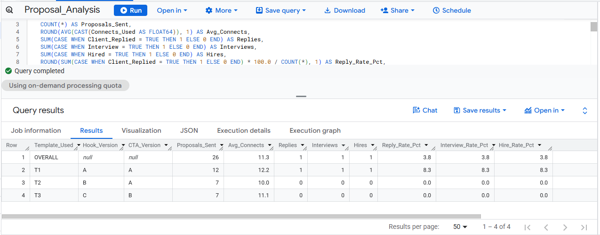


<!-- ===================== -->
<!--        PREVIEW        -->
<!-- ===================== -->
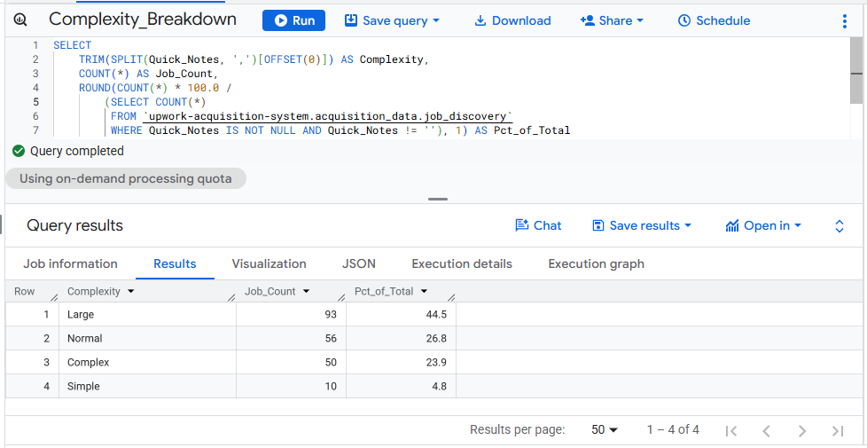


---

## ⚙️ Apps Script System

The Google Sheets automation handles:
- Session management (start, end, yield tracking)
- Job discovery logging with AI-powered Quick Notes classification
- Duplicate job link detection
- Auto-scoring triggers when Final_Decision = APPLY
- AI proposal generation via GPT-4o-mini
- Bid recommendation engine
- Proposal and follow-up tracker auto-population
- Month-end snapshot to Monthly_Performance tab
- Keyword mining from job descriptions
- HubSpot CRM sync: proposals flow into a HubSpot deal pipeline and advance through stages as the client views, replies, and hires
- Guided setup wizard (sidebar UI) that provisions all pipeline sheets and formulas for a new user in one pass

[Upwork Acquisition System Apps Script](https://github.com/visualkirby/Upwork-Acquisition-Pipeline/blob/main/apps-script/) 

---

## 🔗 HubSpot CRM Sync

`apps-script/27_HubSpot_Sync.gs` mirrors the proposal funnel into a HubSpot deal pipeline over the HubSpot CRM API (Private App token, bearer auth). The sync is one-way, Sheet to HubSpot:

| Sheet event | HubSpot action |
|---|---|
| Proposal marked `Sent` | Create Contact (by client name) + Deal, place in **Proposal Sent** stage, associate the two, write both IDs back to Proposal_Tracker |
| `Viewed` = Y | Move Deal to **Reply Received** |
| `Interview` = Y | Move Deal to **Interview** |
| `Hired` = Y | Move Deal to **Hired** |

Deal and Contact IDs are stored on the Proposal_Tracker row, so stage moves patch by ID with no re-search. The pipeline ID and four stage IDs come from the Settings sheet, never hardcoded. Every HubSpot call is wrapped so an outage or missing config logs and moves on without breaking the sheet-side flow.

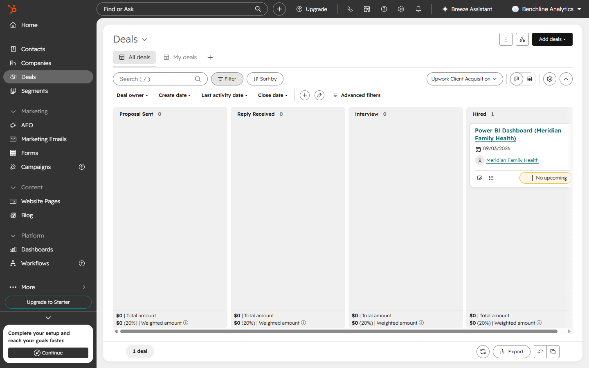

Each stage move is written by the sync, not by hand. The deal's activity timeline records the automated transitions and attributes them to the Private App:

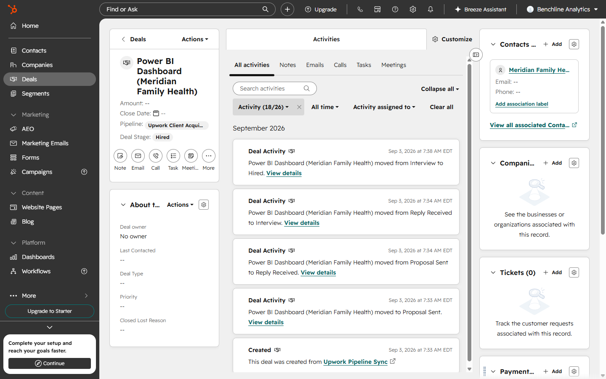

### Setup

Create a HubSpot Private App with contacts + deals read/write scopes:

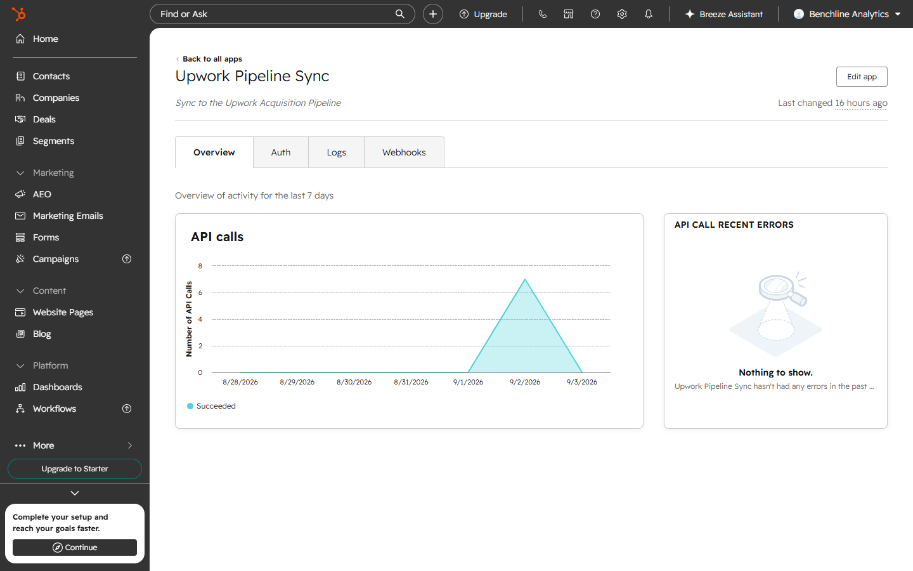

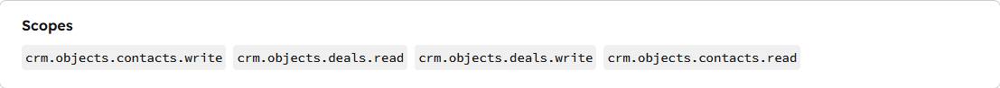

Then run `System Tools > Setup HubSpot Access Token`, build a deal pipeline with the four stages above, and add `HubSpot_Pipeline_ID` plus `HubSpot_Stage_Proposal_Sent` / `_Reply_Received` / `_Interview` / `_Hired` rows to the Settings sheet.

---

## 🔑 Key Results (April 2026)

| Metric | Value |
|--------|-------|
| Jobs Discovered | 209 |
| Moved to Scoring | 121 (57.9%) |
| APPLY Decisions | 85 (40.7%) |
| Proposals Sent | 26 (12.0%) |
| Replies | 1 |
| Interviews | 1 |
| Hires | 1 |
| Avg Job Score | 0.71 |
| Top Keyword by Priority | Power BI Sales Dashboard |

---

## 🔄 Live Refresh Architecture

The pipeline is configured for semi-live updates without manual CSV exports:

- **Google Sheets:** live data entry via Apps Script automation
- **BigQuery External Tables:** 6 source tabs connected as live external data sources
- **Connected Sheets:** 8 SQL queries run against external tables on a daily schedule
- **Power Query (Excel):** connects to Connected Sheets result tabs, refreshes on file open and every 60 minutes while open
- **Dashboard:** all KPI tiles and charts update automatically on refresh

No CSV exports required after initial setup.

---

## 🛠️ Tools & Technologies

<!-- ===================== -->
<!--        PREVIEW        -->
<!-- ===================== -->
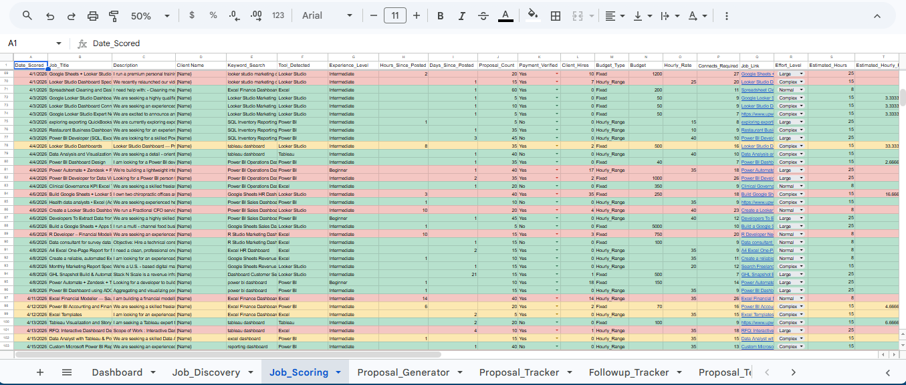

- **Google Sheets:** operational data entry and formula layer
- **Google Apps Script:** automation, AI integration, session management
- **BigQuery:** SQL analysis and data warehousing
- **OpenAI GPT-4o-mini:** Quick Notes classification, proposal generation, bid recommendations
- **HubSpot CRM API:** deal-pipeline sync from the proposal funnel
- **Excel:** dashboard visualization layer

<!-- ===================== -->
<!--        PREVIEW        -->
<!-- ===================== -->
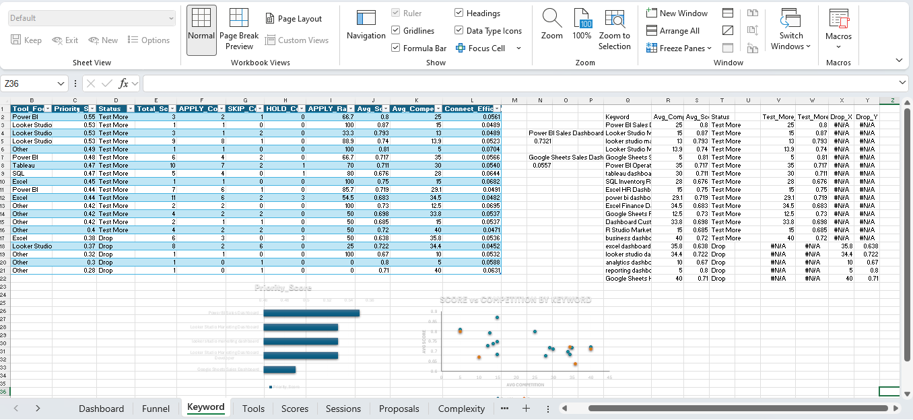

---

## 📁 Repository Structure

```
Upwork-Acquisition-Pipeline/
├── README.md
├── queries/
│   ├── 01_pipeline_funnel.sql
│   ├── 02_keyword_performance.sql
│   ├── 03_tool_market_share.sql
│   ├── 04_score_distribution.sql
│   ├── 05_session_performance.sql
│   ├── 06_proposal_analysis.sql
│   └── 07_complexity_breakdown.sql
├── apps-script/
│   ├── 00_Setup_Wizard.gs
│   ├── 01_Menu.gs ... 26_Keyword_Intelligence.gs
│   ├── 27_HubSpot_Sync.gs
│   ├── *_Sidebar.html
│   └── appsscript.json
└── screenshots/
    ├── Google_BigQuery.png
    ├── Pipeline_Funnel_Results.png
    ├── Keyword_Performance_Results.png
    ├── Tool_Market_Share_Results.png
    ├── Score_Distribution_Results.png
    ├── Session_Performance_Results.png
    ├── Proposal_Analysis_Results.png
    ├── Complexity_Breakdown_Results.png
    ├── Google_Sheets_System.png
    ├── Excel_System.png
    ├── hubspot-deal-pipeline.png
    ├── hubspot-deal-record.png
    ├── hubspot-private-app.png
    └── hubspot-private-app-scopes.png
```

---

## 🔗 Related Project

The SQL exports from this pipeline feed directly into the Excel dashboard:
[Upwork Acquisition Dashboard](https://github.com/visualkirby/Upwork-Acquisition-Dashboard)

---

# Author

**Sawandi Kirby**

Data Analytics & Business Intelligence
Benchline Analytics - Data intelligence for organizations that mean business.

- GitHub: https://github.com/visualkirby
- LinkedIn: https://linkedin.com/in/sawandi-kirby
- Kaggle: https://kaggle.com/sawandikirby
